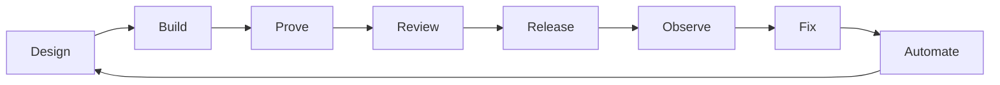

# Brian Batt

Software engineer building production systems, developer tools, and AI engineering workflows. Creator of [briansjobsearch.com](https://briansjobsearch.com).

I design, ship, and operate software across the full lifecycle: product code, APIs, CI/CD, release decisions, production deploys, incident response, reliability automation, and coding-agent workflows. The useful work often sits between the boundaries teams usually split apart.

**Links:** [Brian's Job Search](https://briansjobsearch.com) · [LinkedIn](https://www.linkedin.com/in/brianbatt/) · [Agent Skills](https://github.com/elearningplugins/brians-agent-skills)

## What I'm building

### [Brian's Agent Skills](https://github.com/elearningplugins/brians-agent-skills)

Engineering judgment as reusable instructions for AI coding agents (Cursor, Claude Code, Codex, and other `SKILL.md` tools).

Not prompt templates. Executable habits for PR quality, TypeScript testing, property-based testing, and mutation analysis — so an agent can decide whether code is actually good, not only generate more of it.

### [Brian's Job Search](https://briansjobsearch.com)

A product for finding newly posted jobs from company career sites / ATS sources, with a focus on freshness and page-aware AI assistance.

Built after a layoff. ~74,000 users in the first week; still used by thousands. Public product above — full application source is not open.

### Engineering systems from production work

At Formant (~3 years; official title QA Manager), the role expanded into hands-on engineering ownership across production software, releases, reliability, customer engineering, and automation:

- **Shipped production TypeScript / React / API code** — frontend behavior, backend services, visualization, teleoperation UI, SDK/library changes, and build/toolchain work.
- **Performance across UI ↔ API ↔ data** — diagnosed a stream-picker path paying for ~324k rows / ~29 MB / ~11s, redesigned the query strategy, and brought the expensive lookup to ~0.5s.
- **Release engineering** — release candidates, stage validation, ship/no-ship, production deploys, hotfixes, and deploy automation across ~100 release/hotfix events; backend deploy time reduced from ~20–30 minutes to under 7.
- **Production ownership** — end-to-end incident work (detect → root cause → fix → deploy → validate), including cases where those roles were held in one incident.
- **Edge-runtime continuity** — kept a Go/Bazel robotics Agent path buildable, testable, and releasable through toolchain, ARM64, Docker, CI, and protobuf/gRPC compatibility work.
- **Quality systems with engineering judgment** — Playwright, approval-gated visual regression (built a standalone cross-product VRT system from scratch in 2025; ~277 URLs × 3 envs, baseline PRs, human approval as source of truth; optional Claude classification, disableable for cost), plus example + property + mutation testing.
- **AI as systems design** — event-driven agent pipelines for Playwright test authoring and repair. Generation funnel: 1,904 requests → 67 PRs → 32 merged. Repair funnel: 15 requests → 11 PRs → 11 merged. Agents did better when bounded by a concrete failure and rich runtime evidence.

I'm reconstructing non-proprietary pieces of the visual-regression architecture for public use. Until that lands as a dedicated public repo, the judgment is visible in the agent skills above.

## Engineering focus

- TypeScript / JavaScript / Node / React
- APIs, data cardinality, and performance measurement
- CI/CD, GitHub Actions, release and deploy automation
- Production debugging, reliability, customer engineering
- Playwright and test architecture that catches real defects
- Coding agents, agent skills, orchestration, and human review gates
- Developer tooling and automation

## How I think about engineering

Interesting problems live between development ↔ quality ↔ releases ↔ production ↔ customers.

The question isn't only whether code works. It's whether we can prove it works, ship it safely, understand when it breaks, and automate the work humans shouldn't have to repeat.

---

Open to senior / staff software engineering roles where ownership spans product code, platforms, releases, production, and AI-assisted engineering practice.
