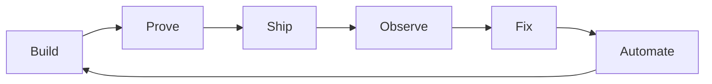

# Brian Batt

Software engineer building developer tools, quality systems, and AI agent workflows. Creator of [briansjobsearch.com](https://briansjobsearch.com).

I work across the boundaries most teams split apart: product code, test systems, CI/CD, release engineering, production debugging, and AI-assisted development. The interesting failures usually live between those boundaries — and so do the useful fixes.

**Links:** [Brian's Job Search](https://briansjobsearch.com) · [LinkedIn](https://www.linkedin.com/in/brianbatt/) · [Agent Skills](https://github.com/elearningplugins/brians-agent-skills)

## What I'm building

### [Brian's Agent Skills](https://github.com/elearningplugins/brians-agent-skills)

Engineering judgment as reusable instructions for AI coding agents (Cursor, Claude Code, Codex, and other `SKILL.md` tools).

Not prompt templates — executable habits for PR quality, TypeScript testing, property-based testing, and mutation analysis. The point is not more code generation. It is better decisions about whether the code is actually good.

### [Brian's Job Search](https://briansjobsearch.com)

A job search product focused on **freshness**: finding newly posted roles from company career sites / ATS sources faster than traditional aggregators tend to surface them.

Built after a layoff. Roughly 74,000 users in the first week; still used by thousands of job seekers. Public product link above — core application code is not fully open source.

### Quality and release systems

At Formant (QA Manager, ~3 years), I owned quality engineering, release engineering, production debugging, and automation that crossed development, QA, reliability, and support. That included Playwright systems, hourly visual regression with historical baselines and image-diff analysis, AI-assisted failure classification, automated baseline-update PRs, Slack review workflows, GitOps-style release gates, property-based testing (fast-check), and mutation testing (Stryker).

I'm reconstructing the non-proprietary parts of that visual-regression architecture for public use. Until that lands as a dedicated public repo, the engineering approach is already visible in the agent skills above.

## Engineering focus

- TypeScript / JavaScript / Node
- Playwright and test architecture
- CI/CD, GitHub Actions, release engineering
- Reliability and production investigation
- Developer tooling and automation
- AI coding agents, agent skills, and review workflows

## How I think about engineering

The question isn't only whether code works.

It's whether we can prove it works, ship it safely, understand when it breaks, and automate the work humans shouldn't have to repeat.

---

Open to senior software engineering roles where ownership spans product code, quality systems, and AI-assisted engineering practice.
