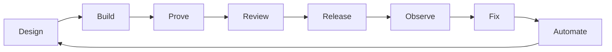

# Brian Batt

Software engineer building production systems, developer tools, and AI engineering workflows. Creator of [briansjobsearch.com](https://briansjobsearch.com).

I design, ship, and operate software across the full lifecycle: product code, APIs, CI/CD, release decisions, production deploys, incident response, reliability automation, and coding-agent workflows. The useful work often sits between the boundaries teams usually split apart.

**Links:** [Brian's Job Search](https://briansjobsearch.com) · [LinkedIn](https://www.linkedin.com/in/brianbatt/) · [Agent Skills](https://github.com/elearningplugins/brians-agent-skills)

## What I'm building

### [Brian's Agent Skills](https://github.com/elearningplugins/brians-agent-skills)

Engineering judgment as reusable instructions for AI coding agents (Cursor, Claude Code, Codex, and other `SKILL.md` tools).

Not prompt templates. Executable habits for PR quality, TypeScript testing, property-based testing, and mutation analysis — so an agent can decide whether code is actually good, not only generate more of it.

### [Brian's Job Search](https://briansjobsearch.com)

Finds newly posted jobs directly from company career sites and ATS sources, with an emphasis on freshness and contextual AI assistance. Reached ~74,000 users in its first week and continues to serve thousands of job seekers. The product is public; its source is private.

## Selected engineering work

At Formant, my QA Manager title grew into hands-on engineering ownership across production software, releases, reliability, customer engineering, automation, and robotics tooling.

- **Product engineering:** shipped TypeScript/React/API work across frontend, backend, visualization, teleoperation, and shared libraries. One high-cardinality UI/data problem was pulling ~324k rows / 29 MB; redesigning the query path reduced the slow lookup from ~11–16s to ~0.5s.
- **Production & releases:** owned release readiness and production deployment, built CI/CD and release automation, investigated incidents, and shipped production fixes.
- **Engineering systems:** built Playwright-based visual regression, property/mutation testing workflows, production monitors, and AI-assisted test authoring/repair systems.
- **Platform/tooling:** worked across Go/Bazel, ARM64, Docker, GitHub Actions, protobuf/gRPC, Python SDK tooling, and robotics edge-runtime compatibility.

## Engineering focus

- TypeScript / JavaScript / Node / React
- APIs, data cardinality, and performance measurement
- CI/CD, GitHub Actions, release and deploy automation
- Production debugging, reliability, customer engineering
- Playwright and test architecture that catches real defects
- Coding agents, agent skills, orchestration, and human review gates
- Developer tooling and automation

## How I think about engineering

Interesting problems live between development ↔ quality ↔ releases ↔ production ↔ customers.

The question isn't only whether code works. It's whether we can prove it works, ship it safely, understand when it breaks, and automate the work humans shouldn't have to repeat.

I think about tests the same way. Coverage tells me code executed; it doesn't tell me the tests would catch a defect. I use example tests for behavior we understand, property-based tests to explore cases we didn't think to write by hand, and mutation testing to ask whether the assertions are actually strong enough to notice when the code is wrong.

---

Open to senior / staff software engineering roles where ownership spans product code, platforms, releases, production, and AI-assisted engineering practice.
